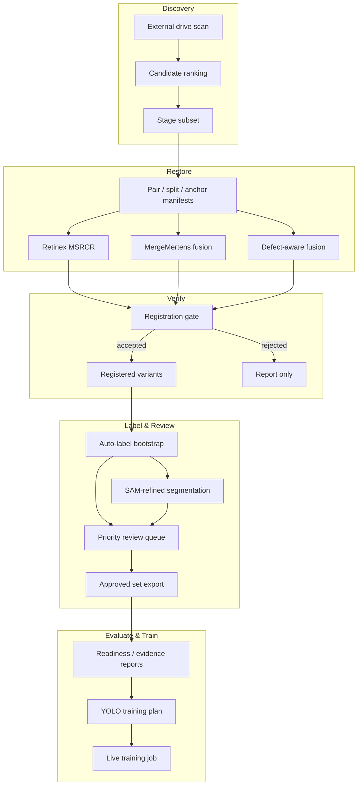

# AutoLabel ML Platform — Demo

> A data-recovery-first ML operations platform for industrial vision.
> FastAPI backend + visual pipeline runner for auto-exposure, Retinex restoration, fusion, auto-labeling, and evaluation-ready dataset export.


Public-safe scaffold of a V1 research platform. The focus is the engineering pattern — a workspace the operator can click through from raw frames to a training-plan — not any specific dataset or customer.

---

## Why this exists

Industrial vision pipelines almost always fail on the data side, not the model side:

- frames come from different lux/exposure conditions and can't be labeled consistently
- auto-labels go stale silently the moment the detector is retrained
- evaluation runs get averaged across incompatible splits, hiding regressions
- "done" gets declared before a review-queue even exists

This platform encodes a recovery-first workflow that makes those failures visible and fixable before they contaminate a training run.

---

## Highlights

| Stage | What it does |
|-------|--------------|
| **Discovery** | Scan external drives for lux-organized datasets, rank candidates, stage a subset |
| **Bootstrap** | Generate pair / split / labeled-anchor manifests with group-level leakage control |
| **Restore** | MSRCR Retinex batch + MergeMertens fusion + defect-aware fusion |
| **Register** | Registration-gate verification before reusing anchor labels on transformed variants |
| **Label** | Auto-label bootstrap merging detection labels from every arm + SAM-refined segmentation |
| **Review** | Priority-ordered review queue with owner, note, history, approved-set export |
| **Evaluate** | Readiness report, evidence benchmark, coverage-adjusted arm ranking |
| **Train** | Dry-run YOLO training & ablation plans; live training orchestration with log tails |
| **Ship** | EXE packaging plan, desktop diagnostics, operator guide, commercial staging |

---

## Architecture



---

## Quick Start

```powershell
git clone https://github.com/hkjung1011/autolabel-ml-platform-demo.git
cd autolabel-ml-platform-demo\apps\api
uv sync
uv run uvicorn app.main:app --reload
```

Open:
- API docs → <http://127.0.0.1:8000/docs>
- V1 UI → <http://127.0.0.1:8000/>

From there, enter a dataset path and workspace root, press **Run Visual Pipeline**, and every stage executes with a live progress bar and artifact preview.

---

## Repository Layout

```text
autolabel-ml-platform-demo/
├── apps/
│   ├── api/                    # FastAPI backend + static V1 UI
│   │   ├── src/app/            # core, domain, services, plugins, api routers
│   │   ├── packaging/          # PyInstaller spec + PowerShell build script
│   │   └── tests/
│   └── web/                    # React/Vite placeholder for future UI migration
├── docs/
│   ├── architecture.md
│   ├── db-schema.md
│   ├── phase1-aelc-vision.md
│   └── ship-metal-autolabel-v2-spec.md
└── packages/                   # reserved for shared SDKs and plugins
```

Note: `apps/ship_defect_labeler/` is excluded from this repo — it is published
separately as [vision-autolabel-demo](https://github.com/hkjung1011/vision-autolabel-demo).

---

## Engineering Notes

- **Recovery-first ordering** — every stage produces a manifest and a readiness % so the operator can see *what is safe to train on right now* rather than running to completion and auditing after.
- **Group-level split control** — train/val/test splits are built at the group level (lux group, scene id) to prevent leakage when the same sample appears in multiple arms.
- **Evaluation integrity** — runs are grouped by `(dataset_version, weight_sha)`; the evidence panel separates the highest-scoring arm from the safest one to promote given current coverage.
- **Operator-grade review** — the review queue keeps owner, note, history, and produces an approved set that is directly re-consumable as the next detector-training dataset.
- **Windows desktop delivery** — PyInstaller spec + PowerShell build script; runtime diagnostics verify OpenCV / Ultralytics / CUDA and surface packaging blockers before shipping.

Deeper design notes: [`docs/architecture.md`](docs/architecture.md), [`docs/phase1-aelc-vision.md`](docs/phase1-aelc-vision.md), [`docs/ship-metal-autolabel-v2-spec.md`](docs/ship-metal-autolabel-v2-spec.md).

---

## What's NOT in this repo

- Any customer-specific dataset, image, or metadata
- Trained weights (`*.pt`, `*.onnx`, `mobile_sam.pt`, etc.) — fetch on demand
- Runtime artifacts (`demo_data/`, `workspaces/`, `evaluation_runs/`, `training_data/`)
- Build outputs (`build/`, `build-staging/`, `dist/`, `.venv/`) — reproduce via `uv sync`

---

## License

MIT — see [LICENSE](LICENSE).
